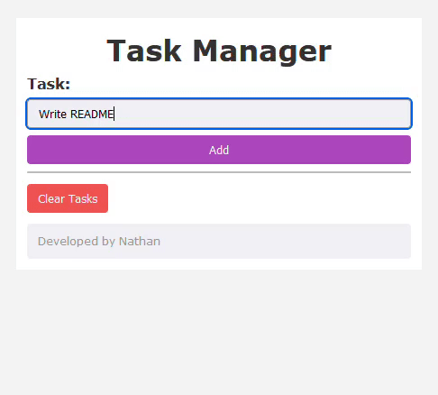

<h1 align="center">ToDoList</h1>
<p align="center">Um gerenciador de tarefas reproduzido de um vídeo tutorial.</p>
<p align="center">
  
</p>
<br />

## Sobre

Este trabalho avaliativo de PHP da disciplina de Programação Web II envolve a reprodução de um gerenciador de tarefas, usando como base um vídeo tutorial no YouTube.

## Funções PHP

O vídeo, disponível na seção <a href="#fontes-consultadas">Fontes Consultadas</a>, utiliza diversas funções do PHP, incluindo `session_start()`, que inicia uma sessão, e `$_SESSION`, que guarda as variáveis da sessão iniciada.

```php
session_start();

if (!isset($_SESSION["tasks"])) {
    $_SESSION["tasks"] = array();
}
```

Além disso, para definir as variáveis no `$_SESSION` o código faz uso de `if` com `isset()`, para verificar o input do usuário na caixa de entrada. Após isso, a tarefa definida é adicionada na array `tasks` através da função `array_push`, e a deleta usando `unset`.

Se o botão "Clear Tasks" é apertado, a array `tasks` é deletada, também utilizando `unset`.

```php
if (isset($_GET["task-name"])) {
    array_push($_SESSION["tasks"], $_GET["task-name"]);
    unset($_GET["task-name"]);
}

if (isset($_GET["clear"])) {
    unset($_SESSION["tasks"]);
}
```

Na lista de tarefas, juntamente com um `foreach`, o código itera entre cada tarefa na array `tasks` e as lista, utilizando o `echo`.

```php
if (isset($_SESSION["tasks"])) {
    echo "<ul>";

    foreach ($_SESSION["tasks"] as $key => $task) {
        echo "<li>$task</li>";
    }

    echo "</ul>";
}
```

## Tecnologias Utilizadas

- ✅ PHP
- ✅ HTML
- ✅ CSS

<h2 id="fontes-consultadas">Fontes Consultadas</h2>

- [Projeto em PHP HTML CSS - Gerenciador de Tarefas - Iniciante - Parte1](https://www.youtube.com/watch?v=dJ49I-QYYUk) (YouTube - ManolitoPHP);
- [session_start - Manual](https://www.php.net/manual/en/function.session-start.php) (PHP)
- [$_SESSION - Manual](https://www.php.net/manual/en/function.session-start.php) (PHP)
- [isset - Manual](https://www.php.net/manual/en/function.isset) (PHP)
- [unset - Manual](https://www.php.net/manual/en/function.unset) (PHP)